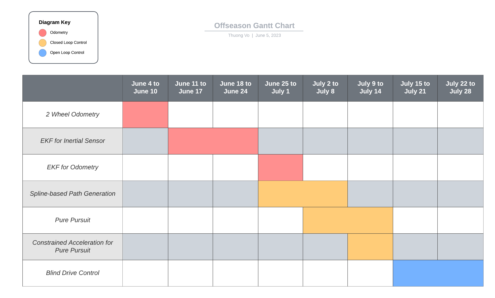

# 3818 Over Under Codebase

## Description

This contains code for the VRC 2023-24 Over Under. The code will be updated over time to match the capabilities of the physical robot, with branches made to archive old code versions when the robot undergoes significant change

## Features

- A set of general functions for assisting with robot control
- A minimal class for controlling a 6 motor tank drive
- A rudimentary operator control loop

### Upcoming

- Odometry with 2 tracking wheels and inertial sensor
- Extended Kalman filter for inertial sensor output and odometry output
- PID control for drivetrain to maintain linear velocity
- Path generation from cubic Hermite splines
- Pure pursuit for a set of paths with constrained acceleration
- Higher accuracy drivetrain motion with pure open loop control
  - Will attempt an internal kinematic model
  - The idea is to estimate the effect of inertia and friction
  - Will be useful to counter drift from full omniwheel drive

## Project Timeline

### June - August

## License

GNU GPLv3

## Credits

Charts made using Lucidchart
